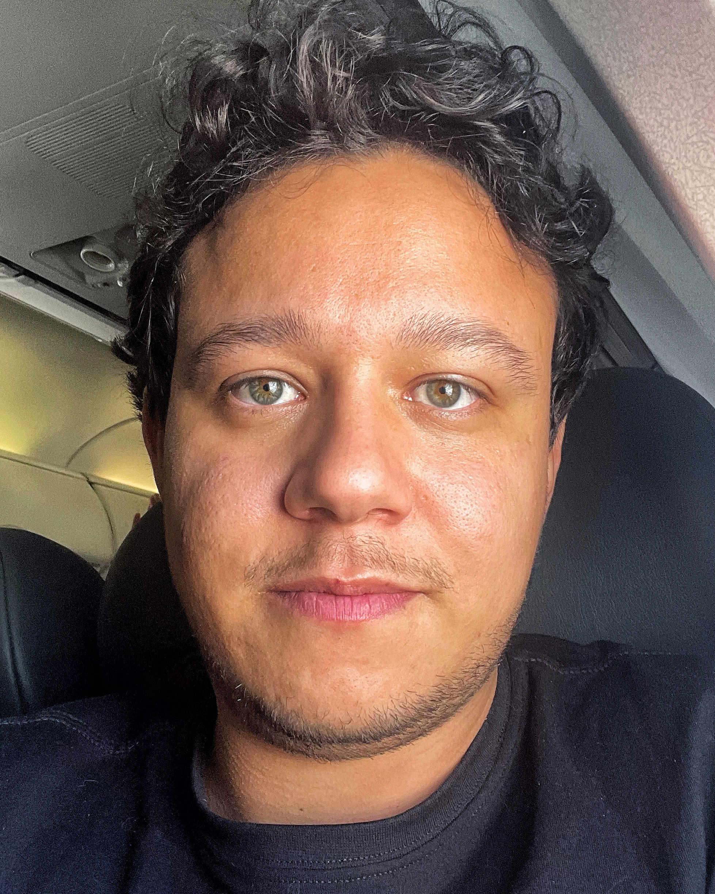

# Curriculum Vitae

## Sobre mim

Olá! Eu sou o Felipe Marques da Silva, tenho 29 anos, e moro com minha namorada e meus dois gatos em São Paulo/SP.
Embora eu tenha me formado engenheiro eletricista pela Universidade de São Paulo, eu trabalho como Desenvolvedor de
Software desde que me graduei. A maioria dos meus conhecimentos em Engenharia de Software foi adquirida sendo
auto-didata, e também aprendi muito com cada uma das experiências profissionais que tive.

Tenho experiência em projetar arquiteturas de software resilientes e evoluíveis, e em produzir código testável, e
manutenível em Python. Tenho sólidas habilidades com OOP, princípios SOLID, Versionamento de Software Git, Serviços de
Nuvem AWS, testes unitários, APIs HTTP, e liderança técnica.

### Meus contatos

**Phone:** +55 16 99172-2315

**Email:** femarques01@gmail.com

## Educação

#### Universidade de São Paulo (2018)

Bacharel em Engenharia Elétrica, Escola de Engenharia de São Carlos.

## Experiência profissional

### **Engenheiro de software sênior** - *Itaú Unibanco* (05/2022 - hoje)

Projetei e desenvolvi uma aplicação para cálculo de Risco e Resultado diário para parte da tesouraria do Itaú.
Utilizei as seguintes tecnologias:

- *Python 3* como linguagem de programação;
- *FastAPI* como framework Web;
- Serviços da AWS como *Amazon ECS*, *Amazon SQS*, *Amazon Elasticache*, *Amazon S3*;
- *PostgreSQL* e *SQL Server* como Bancos de Dados;
- *Redis* para cache distribuído.

#### Principais realizações

- Liderei tecnicamente um time de 5 desenvolvedores;
- Produzi um software com mais de 85% de cobertura de testes;
- Ganhei um prêmio por alto desempenho.

### **Desenvolvedor Backend Sênior** - *Experian* (01/2021 - 05/2022)

Desenvolvi serviços em uma arquitetura de microserviços para o *Serasa Limpa Nome*, utilizando as seguintes tecnologias:

- *Python 3* como linguagem de programação;
- *Flask* e *FastAPI* como frameworks Web;
- Serviços AWS como *Amazon SQS*, *Amazon SNS*, *Amazon Lambda*, *Amazon S3*;
- *PostgreSQL* como banco de dados;
- *Redis* como cache distribuído;
- *Flagr* como solução de Feature Flags;
- *Kubernetes* para orquestração de containers.

#### Principais realizações

- Desenvolvi uma solução para observabilidade que:
    - Captura e cataloga erros não tratados em aplicações Flask/FastAPI;
    - Rastreia e correlaciona requests e logs entre todos os serviços monitorados.

### **Desenvolvedor Backend** - *QI Tech* (11/2019 - 01/2021)

Desenvolvi serviços em uma arquitetura de microserviços para uma fintech focada em empréstimos, utilizando as seguintes
tecnologias:

- *Python 3* como linguagem de programação;
- *Falcon* e *FastAPI* como framework Web;
- Serviços da Google Cloud Platform como *Google PubSub*, *Google Storage*;
- *MySQL* como banco de dados;
- *Kubernetes* para orquestração de containers.

#### Principais realizações

- Ganhei um prêmio por alto desempenho;
- Desenvolvi calculadoras testáveis de empréstimo para tabelas SAC e PRICE;
- Desenvolvi um serviço para consultas SCR (BACEN 3040).

### **Cientista de Dados** - *brain4care* (03/2018 - 11/2019)

Desenvolvimento/manutenção de:

- Sistema de aquisição e armazenamento de dados de monitores multi-paramétricos de pacientes de UTI;
- Algoritmos de processamento de sinais para os dados adquiridos (redução de ruído, identificação de pulsos,
  separação de sinais pulsáteis das tendências, etc);
- Algoritmos para clusterização e extração de features utilizando técnicas de Machine Learning;
- Análises estatísticas para produção de artigos científicos.

#### Principais realizações

- Analisei dados para um estudo de R&R para um novo sensor não-invasivo de pressão intracraniana;
- Analisei dados para um estudo conduzido pela UFSCar para identificar pacientes diabéticos utilizando o sensor de
  pressão intracraniâna não-invasivo;
- API REST para consultar os sinais dos pacientes para fins de visualização;
- Desenvolvi um algoritmo de compressão para reduzir a quantidade de dados retornados.
